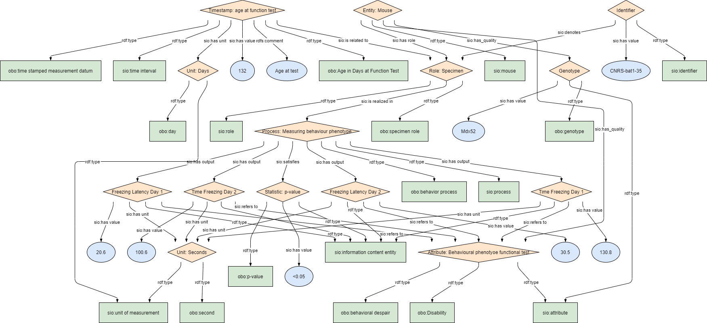
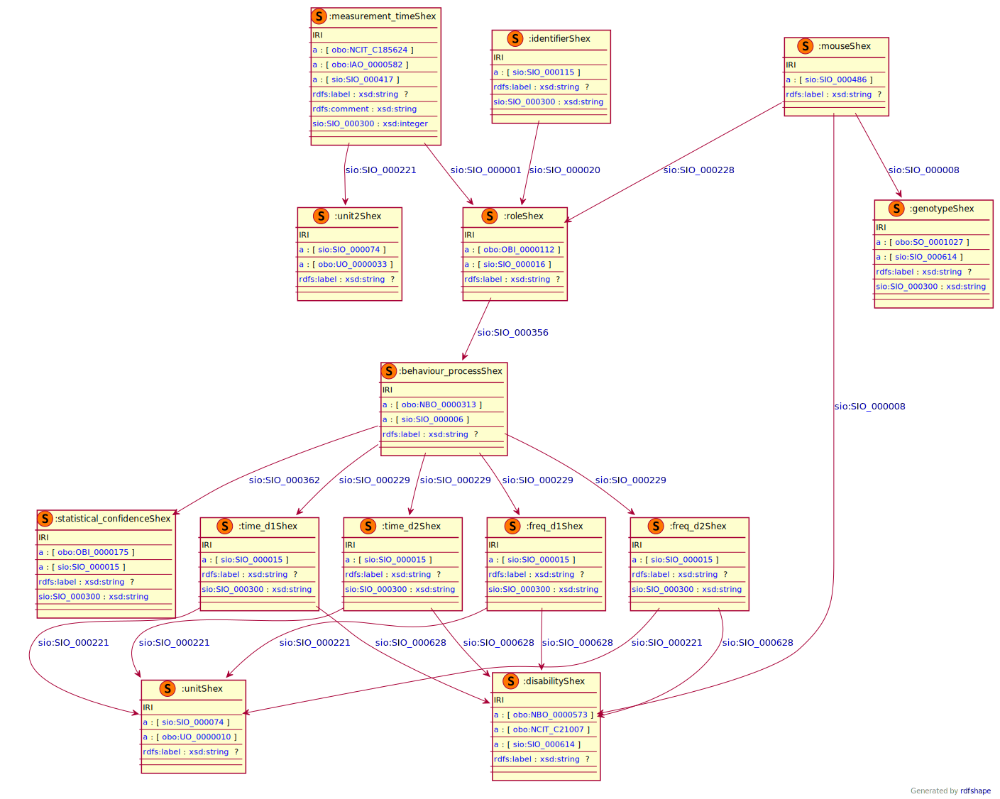

# BIND-Models WP3
This module describes the phenotypic data elements. It specifically covers the data element in the table _Behavioral Studies_. This module is based on the EJP RD CDE semantic model module for _Disease diagnosis_ group [CDE-semantic-model/Phenotype](https://github.com/ejp-rd-vp/CDE-semantic-model/blob/develop/docs/6.Phenotype.md).

<p align="center">
    <a href="../images/rdf/phenptype.png" target="_blank">
        
    </a>
</p>

### Example RDF (turtle)
```ttl
@prefix : <http://w3id.org/bind/data/v1/example-rdf/> .
@prefix obo: <http://purl.obolibrary.org/obo/> .
@prefix sio: <http://semanticscience.org/resource/> .
@prefix xsd: <http://www.w3.org/2001/XMLSchema#> .
@prefix rdfs: <http://www.w3.org/2000/01/rdf-schema#> .


:identifier_ a sio:SIO_000115 ;
    rdfs:label "Identifier"^^xsd:string ;
    sio:SIO_000020 :role_ ;
    sio:SIO_000300 "CNRS-bat1-35"^^xsd:string .


:mouse_ a sio:SIO_000486 ;
    rdfs:label "Mouse"^^xsd:string ;
    sio:SIO_000228 :role_ ;
    sio:SIO_000008 :disability_;
    sio:SIO_000008 :date_attr_.

:role_ a obo:OBI_0000112, sio:SIO_000016 ;
    rdfs:label "Role: Specimen"^^xsd:string ;
    sio:SIO_000356 :behaviour_process_ ;
    sio:SIO_000356 :date_process_ .


:behaviour_process_ a obo:NBO_0000313, sio:SIO_000006 ;
    rdfs:label "Process: Behaviour Process"^^xsd:string ;
    sio:SIO_000229 :time_d1_ ;
    sio:SIO_000229 :time_d2_ ;
    sio:SIO_000229 :freq_d1_ ;
    sio:SIO_000229 :freq_d2_ .

:time_d1_ a sio:SIO_000015; 
    rdfs:label "Time Freezing Day 1"^^xsd:string ;
    sio:SIO_000628 :disability_;
    sio:SIO_000221 :unit_;
    sio:SIO_000300 "130.8"^^xsd:string .

:time_d2_ a sio:SIO_000015; 
    rdfs:label "Time Freezing Day 2"^^xsd:string ;
    sio:SIO_000628 :disability_;
    sio:SIO_000221 :unit_;
    sio:SIO_000300 "100.6"^^xsd:string .

:freq_d1_ a sio:SIO_000015; 
    rdfs:label "Freezing Latency Day 1"^^xsd:string ;
    sio:SIO_000628 :disability_;
    sio:SIO_000221 :unit_;
    sio:SIO_000300 "20.6"^^xsd:string .

:freq_d2_ a sio:SIO_000015; 
    rdfs:label "Freezing Latency Day 2"^^xsd:string ;
    sio:SIO_000628 :disability_;
    sio:SIO_000221 :unit_;
    sio:SIO_000300 "30.5"^^xsd:string .

:unit_ a sio:SIO_000074, obo:UO_0000010;
    rdfs:label "Seconds"^^xsd:string .

:unit2_ a sio:SIO_000074, obo:UO_0000033;
    rdfs:label "Days"^^xsd:string .

:disability_ a sio:SIO_000614, obo:MP_0002573, sio:SIO_010056;
    rdfs:label "Behavioural Despair"^^xsd:string.

:date_process_ a sio:SIO_000006, obo:NCIT_C142470; 
    rdfs:label "Process: Age at Test Process"^^xsd:string;
    sio:SIO_000229 :date_test_ .

:date_test_ a sio:SIO_000015, obo:NCIT_C81317, obo:NCIT_C25150;
    rdfs:label "Age at Test"^^xsd:string;
    sio:SIO_000300 "143"^^xsd:string ;
    sio:SIO_000221 :unit2_;
    sio:SIO_000628 :date_attr_ .

:date_attr_ a sio:SIO_000614, obo:NCIT_C185624;
    rdfs:label "Age at Test Attribute"^^xsd:string. 
   
```

***
### Validation artifacts
##### ShEx figure
<p align="center">
    <a href="../images/shex/phenotype.svg" target="_blank">
        
    </a>
</p>

***
##### ShEx
``` ShEx
PREFIX : <http://w3id.org/bind/data/v1/example-rdf/> 
PREFIX obo: <http://purl.obolibrary.org/obo/> 
PREFIX sio: <http://semanticscience.org/resource/> 
PREFIX xsd: <http://www.w3.org/2001/XMLSchema#> 
PREFIX rdfs: <http://www.w3.org/2000/01/rdf-schema#> 


:identifierShex IRI {
    a [sio:SIO_000115] ;
    rdfs:label xsd:string? ;
    sio:SIO_000020 @:roleShex ;
    sio:SIO_000300 xsd:string 
}

:mouseShex IRI {
    a [sio:SIO_000486] ;
    rdfs:label xsd:string? ;
    sio:SIO_000228 @:roleShex ;
    sio:SIO_000008 @:genotypeShex ;
    sio:SIO_000008 @:disabilityShex
}

:roleShex IRI {
    a [obo:OBI_0000112];
    a [sio:SIO_000016] ;
    rdfs:label xsd:string? ;
    sio:SIO_000356 @:behaviour_processShex
}

:behaviour_processShex IRI {
    a [obo:NBO_0000313];
    a [sio:SIO_000006] ;
    rdfs:label xsd:string? ;
    sio:SIO_000362 @:statistical_confidenceShex ;
    sio:SIO_000229 @:time_d1Shex ;
    sio:SIO_000229 @:time_d2Shex ;
    sio:SIO_000229 @:freq_d1Shex ;
    sio:SIO_000229 @:freq_d2Shex
}

:time_d1Shex IRI {
    a [sio:SIO_000015]; 
    rdfs:label xsd:string? ;
    sio:SIO_000628 @:disabilityShex;
    sio:SIO_000221 @:unitShex;
    sio:SIO_000300 xsd:string
}

:time_d2Shex IRI {
    a [sio:SIO_000015]; 
    rdfs:label xsd:string?;
    sio:SIO_000628 @:disabilityShex;
    sio:SIO_000221 @:unitShex;
    sio:SIO_000300 xsd:string 
}

:freq_d1Shex IRI {
    a [sio:SIO_000015]; 
    rdfs:label xsd:string? ;
    sio:SIO_000628 @:disabilityShex;
    sio:SIO_000221 @:unitShex;
    sio:SIO_000300 xsd:string
}

:freq_d2Shex IRI {
    a [sio:SIO_000015]; 
    rdfs:label xsd:string?;
    sio:SIO_000628 @:disabilityShex;
    sio:SIO_000221 @:unitShex;
    sio:SIO_000300 xsd:string
}

:unitShex IRI {
    a [sio:SIO_000074]; 
    a [obo:UO_0000010];
    rdfs:label xsd:string?
}

:unit2Shex IRI {
    a [sio:SIO_000074];
    a [obo:UO_0000033];
    rdfs:label xsd:string?
}

:disabilityShex IRI {
    a [obo:NBO_0000573]; 
    a [obo:NCIT_C21007];
    a [sio:SIO_000614] ;
    rdfs:label xsd:string?
}

:measurement_timeShex IRI {
    a [obo:NCIT_C185624];
    a [obo:IAO_0000582];
    a [sio:SIO_000417] ;
    rdfs:label xsd:string?;
    rdfs:comment xsd:string ;
    sio:SIO_000300 xsd:integer ;
    sio:SIO_000221 @:unit2Shex ;
    sio:SIO_000001 @:roleShex
}

:statistical_confidenceShex IRI {
    a [obo:OBI_0000175]; 
    a [sio:SIO_000015] ;
    rdfs:label xsd:string?;
    sio:SIO_000300 xsd:string 
}

:genotypeShex IRI {
    a [obo:SO_0001027];
    a [sio:SIO_000614];
    rdfs:label xsd:string?;
    sio:SIO_000300 xsd:string
}
```

