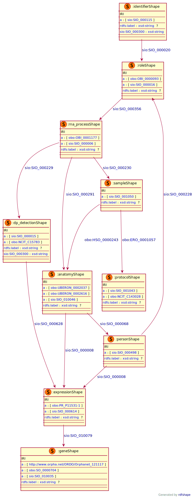

# BIND-Models
This module describes the data elements in the Basescope RNA sequencing . It specifically covers the data element in the table _DCDE Laboratory measurement_. This module is based on the EJP RD CDE semantic model module for _Disease diagnosis_ group [CDE-semantic-model/disease diagnosis](https://github.com/ejp-rd-vp/CDE-semantic-model/blob/master/docs/disease_diagnosis.md).

<p align="center">
    <a href="/rna-seq-wp2/images/rdf/basescope.png" target="_blank">
        
    </a>
</p>

### Example RDF (turtle)
```ttl
@prefix : <http://w3id.org/bind/data/v1/example-rdf/> .
@prefix obo: <http://purl.obolibrary.org/obo/> .
@prefix sio: <http://semanticscience.org/resource/> .
@prefix xsd: <http://www.w3.org/2001/XMLSchema#> .
@prefix rdfs: <http://www.w3.org/2000/01/rdf-schema#> .

:identifier_ a sio:SIO_000115 ;
    rdfs:label "Identifier"^^xsd:string ;
    sio:SIO_000020 :role_ ;
    sio:SIO_000300 "Donor 1"^^xsd:string .

:person_ a sio:SIO_000498 ;
    rdfs:label "Entity: Person"^^xsd:string ;
    sio:SIO_000228 :role_ ;
    sio:SIO_000008 :expression_ .
    
:role_ a obo:OBI_0000093, sio:SIO_000016 ;
    rdfs:label "Role: Patient"^^xsd:string ;
    sio:SIO_000356 :rna_process_ .
    
:rna_process_ a obo:OBI_0001177, sio:SIO_000006 ;
    rdfs:label "Process: Basescope RNA-seq"^^xsd:string ;
    sio:SIO_000291 :anatomy_ ;
    sio:SIO_000229 :dp_detection_ ;
    sio:SIO_000230 :sample_ .

:sample_ a sio:SIO_001050; 
    rdfs:label "Input: Sample"^^xsd:string ;
    obo:HSO_0000243 :anatomy_ ;
    obo:ERO_0001057 :protocol_ .
    
:anatomy_ a obo:UBERON_0002037, obo:UBERON_0002616, sio:SIO_010046;
    rdfs:label "Target: Anatomy"^^xsd:string ;
    sio:SIO_000008 :expression_ ;
    sio:SIO_000068 :person_ .

:protocol_ a sio:SIO_001043, obo:NCIT_C143028 ; 
    rdfs:label "FFPE or FF"^^xsd:string .
    
:dp_detection_ a sio:SIO_000015, obo:NCIT_C15783 ;
    rdfs:label "Outout: Dystrophin Isoform Detection"^^xsd:string ;
    sio:SIO_000300 "Yes/No"^^xsd:string ;
    sio:SIO_000628 :expression_ .
    
:expression_ a obo:PR_P11531-1, sio:SIO_000614 ;
    rdfs:label "Attribute: Dystrophin isoform"^^xsd:string ;
    sio:SIO_010079 <https://identifiers.org/MGI:94909> .

<https://identifiers.org/MGI:94909> a <http://www.orpha.net/ORDO/Orphanet_121117>, obo:SO_0000704, sio:SIO_010035 ;
    rdfs:label "Gene: Dmd"^^xsd:string .
```

### Validation artifacts
##### ShEx figure
<p align="center">
    <a href="../images/shex/basescope.svg" target="_blank">
        
    </a>
</p>

***
##### ShEx
``` ShEx
PREFIX : <http://w3id.org/bind/data/v1/example-rdf/> 
PREFIX obo: <http://purl.obolibrary.org/obo/> 
PREFIX sio: <http://semanticscience.org/resource/> 
PREFIX xsd: <http://www.w3.org/2001/XMLSchema#> 
PREFIX rdfs: <http://www.w3.org/2000/01/rdf-schema#> 
PREFIX prov: <http://www.w3.org/ns/prov#> 

:identifierShape IRI {
    a [sio:SIO_000115] ;
    rdfs:label xsd:string?;
    sio:SIO_000020 @:roleShape ;
    sio:SIO_000300 xsd:string 
}

:personShape IRI {
    a [sio:SIO_000498];
    rdfs:label xsd:string? ;
    sio:SIO_000228 @:roleShape;
    sio:SIO_000008 @:expressionShape
}
    
:roleShape IRI {
    a [obo:OBI_0000093];
    a [sio:SIO_000016] ;
    rdfs:label xsd:string?;
    sio:SIO_000356 @:rna_processShape
}
    
:rna_processShape IRI {
    a [obo:OBI_0001177];
    a [sio:SIO_000006] ;
    rdfs:label xsd:string? ;
    sio:SIO_000291 @:anatomyShape ;
    sio:SIO_000229 @:dp_detectionShape ;
    sio:SIO_000230 @:sampleShape
}

:sampleShape IRI {
    a [sio:SIO_001050]; 
    rdfs:label xsd:string? ;
    obo:HSO_0000243 @:anatomyShape ;
    obo:ERO_0001057 @:protocolShape
}
    
:anatomyShape IRI {
    a [obo:UBERON_0002037];
    a [obo:UBERON_0002616];
    a [sio:SIO_010046];
    rdfs:label xsd:string?;
    sio:SIO_000008 @:expressionShape ;
    sio:SIO_000068 @:personShape
}

:protocolShape IRI {
    a [sio:SIO_001043];
    a [obo:NCIT_C143028] ; 
    rdfs:label xsd:string?
}
    
:dp_detectionShape IRI {
    a [sio:SIO_000015];
    a [obo:NCIT_C15783];
    rdfs:label xsd:string? ;
    sio:SIO_000300 xsd:string ;
    sio:SIO_000628 @:expressionShape
}
    
:expressionShape IRI {
    a [obo:PR_P11531-1]; 
    a [sio:SIO_000614] ;
    rdfs:label xsd:string?;
    sio:SIO_010079 @:geneShape
}

:geneShape IRI {
    a [<http://www.orpha.net/ORDO/Orphanet_121117>]; 
    a [obo:SO_0000704];
    a [sio:SIO_010035] ;
    rdfs:label xsd:string?
}
```
